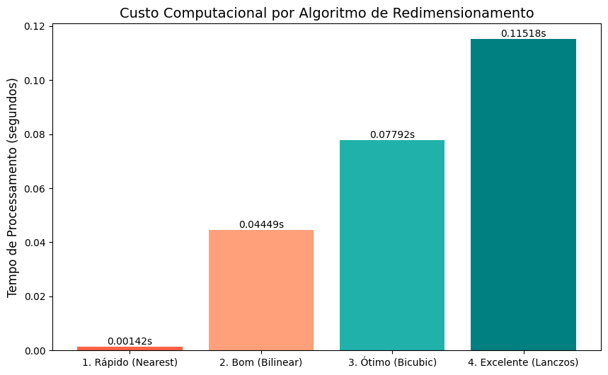

# Disciplina: Programação Paralela
**Professor:** Samuel Xavier de Souza
**Projeto PP 03**

## Descrição da Tarefa

Implemente e compare duas versões de um programa em C que calcule uma aproximação de π usando a série matemática de Leibniz. A primeira versão deve ser puramente sequencial, enquanto a segunda deve ser otimizada explorando o paralelismo em nível de instrução (ILP). O objetivo é medir o tempo de execução de ambas, comparar os resultados e analisar o ganho de desempenho (*speedup*).

Adicionalmente, um estudo de caso prático sobre redimensionamento de imagens é apresentado para ilustrar o mesmo *trade-off* em um domínio visual.

## Objetivo do Teste

 O objetivo deste estudo é demonstrar empiricamente um dos princípios mais importantes da computação de alto desempenho: a relação direta entre **custo computacional (tempo) e a precisão do resultado**, e como técnicas de **programação paralela** podem mitigar esse custo. Este projeto utiliza dois experimentos distintos — o cálculo de π e o redimensionamento de imagens — para visualizar esse *trade-off* fundamental e a eficácia da otimização.

## Experimento 1: A Série de Leibniz para π

 Para este experimento, foi utilizada a **série de Leibniz**, que converge lentamente para π/4, tornando-a um excelente exemplo didático. A fórmula é:

$$
\frac{\pi}{4} = \sum_{n=0}^{\infty} \frac{(-1)^n}{2n+1} = 1 - \frac{1}{3} + \frac{1}{5} - \frac{1}{7} + \frac{1}{9} - \cdots
 $$ 

A convergência lenta exige um grande número de iterações para obter alta precisão, o que torna o custo computacional evidente e a otimização, necessária.

### Procedimentos de Execução (Cálculo de π)

O projeto consiste em dois códigos-fonte em C, que devem ser compilados separadamente com a biblioteca matemática (`-lm`).

1.  **Compilação:**
    * **Versão Sequencial:** `gcc pi_sequencial.c -o pi_sequencial -lm`
    * **Versão Otimizada (ILP):** `gcc pi_ilp.c -o pi_ilp -lm`

2.  **Execução:**
    Cada programa pode ser executado para gerar seus respectivos resultados de tempo e precisão.
    ```bash
    ./pi_sequencial
    ./pi_ilp
    ```

### Resultados Comparativos e Speedup (Cálculo de π)

 A execução e a coleta de dados de ambas as versões produziram os resultados consolidados na tabela abaixo.  A coluna "Speedup" (calculada como Tempo Sequencial / Tempo ILP) demonstra o ganho de desempenho da versão otimizada.

| Iterações | Tempo Sequencial (s) | Tempo ILP (s) | Speedup |
| :--- | :--- | :--- | :--- |
| 10 | 0.0000005 | 0.0000001 | 5.00x |
| 100 | 0.0000003 | 0.0000001 | 3.00x |
| 1,000 | 0.0000026 | 0.0000010 | 2.60x |
| 10,000 | 0.0000261 | 0.0000098 | 2.66x |
| 100,000 | 0.0002666 | 0.0000979 | 2.72x |
| 1,000,000 | 0.0029831 | 0.0009832 | 3.03x |
| 10,000,000 | 0.0347278 | 0.0117944 | 2.94x |
| 100,000,000 | 0.2930814 | 0.1071978 | 2.73x |
| 1,000,000,000 | 2.5113620 | 1.4679070 | 1.71x |
 _Tabela com dados extraídos do relatório._

---

## Estudo de Caso Prático: O Trade-off no Redimensionamento de Imagens

 Para complementar a análise numérica, foi conduzido um experimento prático no domínio de processamento de imagens, que ilustra o *trade-off* de forma visual.  A tarefa consistiu em redimensionar uma imagem de alta resolução utilizando quatro algoritmos de interpolação diferentes, cada um com um custo e uma qualidade de resultado distintos.

### Metodologia do Experimento de Imagem

 Foi desenvolvido um script em Python com as bibliotecas `Pillow` e `Matplotlib`. Uma imagem de arquitetura foi escolhida por conter linhas retas e detalhes que evidenciam artefatos de baixa qualidade. Os seguintes algoritmos foram comparados:

**Nearest Neighbor:** O mais rápido. Copia o pixel mais próximo, sem cálculos complexos. Gera um resultado serrilhado ("pixelado").
**Bilinear:** Intermediário. Calcula a média entre 4 pixels vizinhos.  Suaviza o serrilhado, mas pode borrar a imagem.
* **Bicubic:** Alta qualidade. Considera 16 pixels vizinhos para um resultado mais suave e nítido.
* **Lanczos:** Qualidade excelente. Usa uma função mais complexa para preservar a nitidez, ao custo de um processamento mais intenso.

### Análise e Resultados Visuais do Estudo de Caso

Os resultados visuais e os tempos de execução medidos mostram o mesmo padrão do cálculo de π. A Figura 1 demonstra a diferença de qualidade visual entre os algoritmos, especialmente na área de zoom, enquanto a Figura 2 quantifica o custo computacional de cada um.

**Baixo Custo / Baixa Precisão:** O algoritmo *Nearest Neighbor* é extremamente rápido, mas a qualidade visual é pobre.
**Alto Custo / Alta Precisão:** O algoritmo *Lanczos* produz um resultado visualmente superior, mas exige um investimento computacional drasticamente maior.


**Figura 1:** Comparativo visual da qualidade de redimensionamento entre os algoritmos. As imagens na linha inferior mostram uma área de zoom para destacar as diferenças em nitidez e artefatos.


**Figura 2:** Gráfico de barras comparando o tempo de processamento (em segundos) para cada algoritmo de redimensionamento.

A escolha do algoritmo ideal depende dos requisitos da aplicação. Para gerar miniaturas (*thumbnails*) em tempo real, a velocidade do *Bilinear* pode ser aceitável. Para processar uma foto profissional para impressão, o custo do *Lanczos* é justificável].

## Gráfico de Desempenho (Cálculo de π)

Os gráficos abaixo consolidam a análise de desempenho do experimento de cálculo de π, mostrando a relação entre tempo de execução, erro e o *speedup* obtido com a otimização ILP.


**Figura 3:** Gráficos comparativos de Tempo de Execução, Convergência de Erro e Speedup.

## Conclusão Geral

Ambos os experimentos, um numérico e outro visual, validam o *trade-off* fundamental entre custo computacional e precisão. Aumentar a precisão — seja diminuindo o erro no cálculo de π ou melhorando a fidelidade visual de uma imagem — tem um custo de processamento associado.

A otimização com paralelismo em nível de instrução (ILP), demonstrada no cálculo de π, é a ferramenta para gerenciar este equilíbrio.Ao permitir que o hardware opere de forma mais eficiente , a otimização não elimina o *trade-off*, mas torna o custo de alcançar alta precisão mais baixo e computacionalmente mais viável.